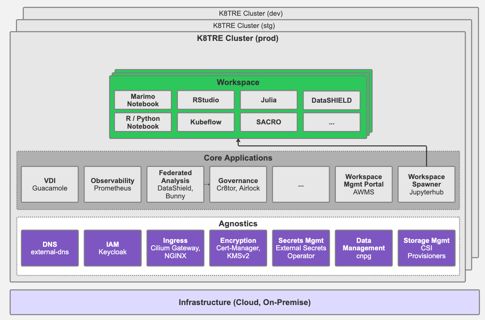
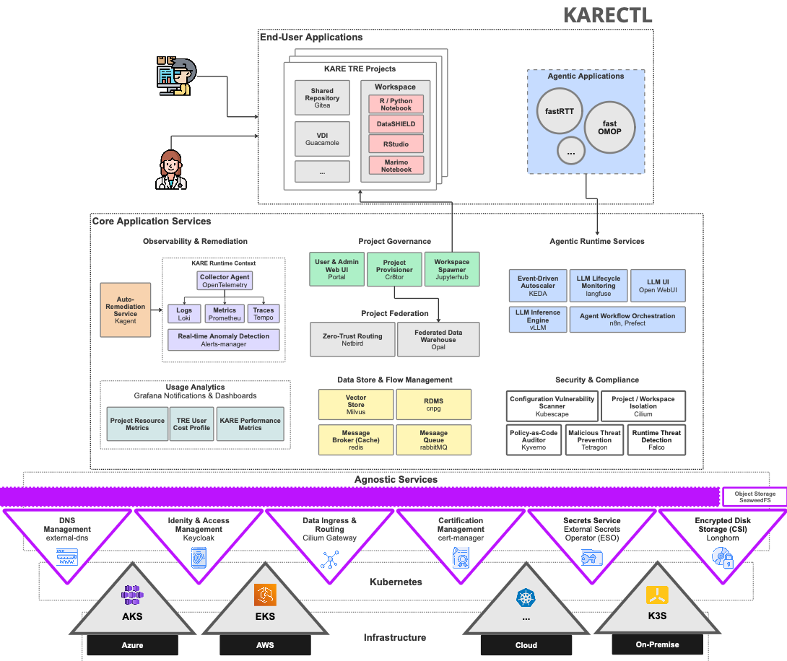

# From TRE to KARECTL: Our Evolution of The Trusted Research Environment in the Age of AI

Behind the scenes, Lancashire Teaching Hospitals NHS Foundation Trust (LTH) has been pursuing an ambitious goal: to deliver a secure, digital infrastructure that can effortlessly empower both humans and agents to harness the vast amounts of data to support lower-cost, higher-quality healthcare services. While, many organisations likely harbour similar ambitions both in and outside of the healthcare space, working towards it has demanded a mini-revolution on several technical and organisational fronts, that have been quietly playing out under the louder backdrop of the ongoing [AI health arms race][XXX](https://pubmed.ncbi.nlm.nih.gov/42052564/). At LTH, the need to facillitate AI-supported research and working practices at scale is growing at pace [XXX]. To deliver on our goal, over the past 6 years we have been actively [infrastructuring](https://aisel.aisnet.org/jais/vol10/iss5/1/)[XXX] - that is, performing the continuous development of key foundational elements (standardisation of data, automation of information governance, availability of analytical toolchains and reshaping operational practices) so AI research and agentic capabilities for day-to-day work practices can be delivered through more intelligent, automated mechanisms across a secure, scalable and sustainable localised infrastructure. 

>Comment: TRE functionality is just one aspect of what KARECTL offers. I think we should pitch our platform as an AI-conformant secure analytics platform that _also_ provides TRE capabilities. So the same platform can be used for operational applications like we do at Lancs. This means we can "sell" this to any NHS trust or organisation that wants to use this just for internal use cases (as well as TRE). Or is this too much to weave into this blog and/or will confuse people?

In this post, we will begin to highlight our recent journey developing trusted research environments (TREs) and the requirements driving our need to deliver next-generation TRE frameworks that posess new characteristics that can mitigate cloud vendor lock-in risks and better exploit emerging AI capabilities to enhance TRE administration processes and harden TRE security against looming AI-enabled threats [XXX]. Alongside development of TRE infrastructure at LTH, critical complementary work is happening to help meet our wider ambition:

- Data Harmonisation
    - See our work [here](https://###) on the development of tools to standardise disparate clinical datasets through OMOP and the creation of [agentic tools](https://###) for real-world evidence (RWE) studies.
- Data Project Governance & Infrastructure Automation
    - [Learn more](https://zenodo.org/records/19366020) about CR8TOR, a metadata-driven framework for the semi-automated orchestration of TRE project governance, data ingestion, and infrastructure resources.
    - [Watch](https://www.youtube.com/watch?v=aRrZpoF2YeA) a walkthrough of the CR8TOR framework in a federated setting, developed as part of the FOCUS-5 project.
- Secure Research Analytics & Data Access
    - [K8TRE](https://docs.k8tre.org/latest/) is a vendor-agnostic trusted research analytics environment built on Kubernetes.
    - Creating trusted research and analytics environments that enable researchers, clinicians, and partners to collaborate while maintaining strict governance and security standards.
- Local Compute, Agentic Development & Runtime Environment
    - Developing local compute and runtime environments that support the secure development, testing, and deployment of agentic AI capabilities.

## Towards TRE AI-Conformity 

Recognition of the need to innovate beyond traditional approaches to Trusted Research Environment (TRE) infrastructure has played a central role in LTH's digital transformation journey. Our initial effort to develop a secure analytics environment emerged from a practical organisational need to deliver secure access to clinical data for research at a significantly lower cost than available cloud-vendor frameworks (e.g. AzureTRE), while avoiding long-term vendor lock-in. In addition, we were keen to establish an open-source community around any infrastructure developed to ensure long-term support of software, support knowledge exchange within the research software engineering (RSE) community and to mitigate the risks associated with closed software development projects the NHS has often been susceptiable [XXX] (more on our early thinking around this [here](https://LINKEDIN)).

Given these requirements, we began to map the core capabilities and services of traditional TRE implementations and consider how to design an open-source, vendor-agnostic TRE based on Kubernetes (K8s) that could operate across diverse cloud and on-premises environments. Early exploration of a platform-agnostic TRE framework was undertaken through LTH's initial research analytics platform (KRAP/LSCSDE/LANDer)[XXX], where we developed a deeper understanding of how a microservices-based approach could provide a more flexible and sustainable foundation for supporting secure data research projects. The lessons learned from this early TRE platform development work directly informed the architectural principles that later shaped the implementation of K8TRE [XXX] - an open-source Kubernetes-native trusted research environment.

Building on that foundation, and through wider engagement with the UK’s health informatics and research software engineering communities (including DARE), we led K8TRE’s technical development within TREvolution, in collaboration with Lancaster University, the University of Dundee (UoD), and University College London (UCL) [XXX]. The project focused on developing a modular, cloud-agnostic, [SATRE-compliant](https://satre-specification.readthedocs.io/en/stable/) Kubernetes-native TRE that could satisfy a broad range of TRE operator requirements. A key aspect of K8TRE's design is the **agnostics layer**, providing key abstractions for infrastructure-dependent capabilities (e.g. secret providers, networking, identity providers), enabling TRE application services (e.g. secure workspaces, observability, project governance) to operate regardless of the underlying cloud or on-premises infrastructure.

Through the adoption of open cloud-native technologies and modern CI/CD practices (including GitOps), K8TRE has provided a flexible, portable, and sustainable TRE foundation as an alternative to cloud-vendor frameworks. At the same time, demand at LTH is evolving: researchers, clinicians, developers, and healthcare administrators increasingly need TRE environments that can support AI-driven research and agent-based workflows. In response, we have begun to extend our focus beyond vendor-agnostic design to explore AI’s role in trusted research infrastructure, including the practical opportunities and chalSlenges of building AI-conformant TREs. In this context, we see AI-conformance as an important characteristic for next-generation TREs, meaning AI research workloads and agentic workflows are supported under the same governance, security, and audit standards that apply to human-led research that relies on access to sensitive datasets.

>Comment: Will a lot of this be repeated in the DARE blog that we are meant to write as well? Maybe an early link to the TREvolution page, and a reference to K8TRE docs for the architecture diagram (or get rid of this architecture diagram and replace with KARECTL's later on.)

In practical terms, we have begun to translate this shift in focus into practical areas of implementation. In particular, building on K8TRE we have begun to (i) investigate where AI can be safely embedded into day-to-day research environment operations, (ii) address technical gaps to support AI research & agentic workflows, and (iii) strengthen platform resilience:

### **AI research workloads from TRE projects**
LTH is establishing new, on-premise GPU-enabled compute hardware to serve AI training and inference workloads from trusted research projects governed and managed through our secure analytics framework (KARECTL) deployed within a local Kubernetes cluster.

### **TRE agent development and secure deployment runtime**
To support secure in-house development and deployment of agents that depend on LTH's sensitive data assets (e.g. EHR, PIFU) we have begun to implement a runtime environment within our Kubernetes TRE that includes locaised model provisioning supported by vLLM, allowing agents to exploit privacy-preserving LLM inference. In addition, this runtime integrates agentic workflow support (n8n, MLFlow), secure agent observability (i.e. langfuse) for monitoring and governance auditing activities with optional privacy controls to mask sensitive information from traces.

### **TRE AI-assisted workspaces**
We are piloting secure research workspaces that embed AI-assisted notebook capabilities using Marimo integrated with locally provisioned large language models (LLMs) to better support analytical and coding research activities. 

### **TRE infrastructure maintenance agents**
We are undertaking development and assessment of operational agents to better support TRE platform engineers and administrators. In particular, we have begun to develop and trial agents with Site Reliability Engineering (SRE) skillsets that can detect issues within the TRE through contextual signals provided via KARECTL's observability stack and propose (or execute) approved remediations based on a real-time understanding of the TRE state through the Kagent framework for Kubernetes. We believe such capabilities will become important to ensure TRE engineer resource requirements do not scale with increased research and agent usage.

### **TRE cybersecurity agents**
We are investigating a collection of cybersecurity-focused agents for TREs that aim to support continuous security testing, vulnerability discovery, and defensive validation of a TRE's controls. For example, we are developing red-team capture-the-flag (CTF) agents (Breslin) for Kubernetes-native TREs that can be directed to undertake adversarial behaviours (e.g. unauthorised lateral movement across controlled boundaries) within the target environment, emulating actions that could be performed by different TRE stakeholders (i.e. researchers, platform engineers) to highlight security vulnerabilities.   

## KARECTL Architecture

**TODO**

KARECTL, LTH's extension of K8TRE has been designed as a cloud-agnostic, scalable, AI-conformant secure analytics platform to support AI research, AI-assisted research and AI-enabled platform engineering.

KARECTL has the following technical capabilities:

>comment: Do we want to go into so much detail for the LinkedIn post? Or is this us planting the flag now to say we have already done this?

**Local model provisioning and routing (LLM gateway, vLLM)**
KARECTL's 'agentgateway' service provides a locally governed LLM gateway that allows agents operating within the TRE to connect to a collection of model inference backends through a single endpoint. In particular, the agentgateway integrates with KARECTL's agnostics services including keycloak for supporting JWT-based access control. This allows internal agents to perform authenticated OpenAPI requests that can be routed to a variety model inference pools. The gateway implements a dynamic content-based routing method that inspects the agent's request, extracts the model name requested (e.g. Qwen2.5) and attempts to route to an available pool serving the specified model. A range of LLM models are deployed through vLLM that provides an efficient local inference engine for lower-latency model serving.

**Agentic application runtime**
The agentic runtime in KARECTL comprises a collection of services that provide an execution environment where agent-based applications can leverage capabilities that support the end-to-end lifecycle of an agent. These include:

- Observability (Langfuse) to captures prompts and trace execution paths to support debugging, quality assurance and auditability
- LLM UIs (OpenWebUI): Provides a secure interaction layer for researchers and platform engineers to use to communicate with LLM models and support human-in-the-loop agentic workflows
- Model inference (vLLM): Provides a private model inference and serving engine that integrates with KARECTL's agentgateway service
- Workflow Orchestration (n8n, MLflow) provides workflow automation for provisioning agent-based processes

**TRE DevOps Agent Framework (Kagent)**
KARECTL implements the Kagent framework as an application-level service to enable routine TRE platform tasks typically performed by a infrastructure engineer. It allows approved agents to interpret TRE platform context, assist with diagnostics, and propose or execute controlled remediation actions.

## Emerging Challenges

### Ensuring Data Security & Privacy 

Supporting AI-conformity materially increases the TRE attack surface. Kubernetes control planes, model-serving endpoints, vector stores, agent runtimes and workflow engines all introduce potential security vulnerabilities.

At the same time, privacy risk evolves beyond traditional user access patterns. This is particularly the case where sensitive NHS datasets are fed into local inference models, captured in traces or cached as context to support model inference optimisation. For TRE operators, this means extending existing governance controls so they remain effective for AI-assisted and agent-driven workflows.

### Governing Agent Behaviour

Agentic systems introduce a different class of governance challenge because they can plan, decide, and execute multi-step actions with limited human intervention. Within a TRE, this raises practical questions around what an agent is permitted to do, what it is explicitly prevented from doing and how those boundaries are enforced at runtime. From an operator perspective, this requires policy-driven guardrails.

### Managing Costs

>comment: Can we frame this as primarily using agents for operational efficiency with cost reduction as one of the benefits.

Empowering researchers and TRE infrastructure engineers to develop and deploy agentic workloads requires new cost tracking and management capabilities. Cost management has to be treated as a core architectural concern for AI-conformant TREs. Practical controls include local model routing, workload scheduling and quotas, model right-sizing, and clear lifecycle policies for traces and artefacts.

At the same time, one of the central opportunities of AI-conformant TREs is to use automation to offset operational burden. If implemented safely, infrastructure and support agents can reduce repetitive administration and incident triage effort, allowing platform teams to focus on higher-value engineering, assurance, and service improvement.

## Conclusion

The shift in how we think about TREs has evolved significantly over the last 6 years.

Historically, TREs designed primarily as secure environments for researchers to access sensitive data. Increasingly, however, we believethey are becoming platforms that should support a diverse ecosystem of participants, including researchers, analysts, clinicians, applications, AI models, and autonomous agents.

This evolution requires a new set of architectural characteristics..
- cloud-agnostic deployment
- AI-native capabilities
- agent-ready runtimes
- new forms of governance
- observability & auditing.

Significant challenges remain. Cybersecurity threats continue to evolve, governance models must adapt to autonomous systems, and organisations need to develop new expertise spanning cloud-native infrastructure, platform engineering, AI engineering, and security operations.

Yet the opportunity is unbounded. By building AI-conformant Trusted Research Environments, NHS organisations can create a common foundation capable of supporting research, innovation, operational intelligence, and future agentic healthcare systems. In doing so, the TRE evolves from a secure data access platform into a secure execution environment for both human and machine intelligence.